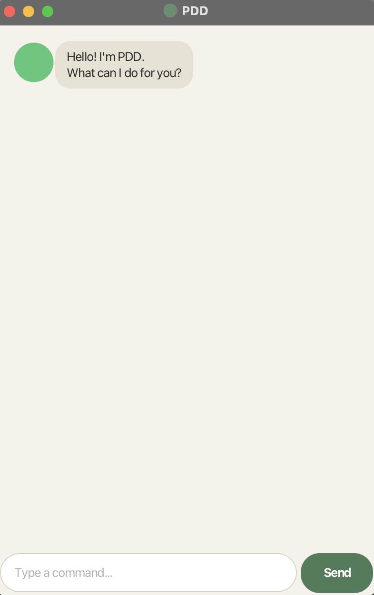

# PDD User Guide

PDD is a desktop chatbot for tracking todos, deadlines, and events. You
type commands, PDD keeps your list, and every change is saved to disk so
your tasks are still there next time you open it.



## Quick start

1. Ensure you have JDK 25 installed.
2. Download the latest `pdd.jar` from the
   [releases page](https://github.com/JerylChwa/ip/releases).
3. Run it with `java -jar pdd.jar` to open the GUI shown above, or type
   a command in the input box and press Enter/click **Send**.

All commands below work the same way whether you're using the GUI or the
console text UI (`./gradlew runText` if running from source).

## Adding a todo

Adds a task with just a description — no date attached.

```
todo borrow book
```

```
Got it. I've added this task:
  [T][ ] borrow book
Now you have 1 tasks in the list.
```

## Adding a deadline

Adds a task that needs to be done by a specific date. The date must be in
`yyyy-MM-dd` format.

```
deadline return book /by 2019-12-01
```

```
Got it. I've added this task:
  [D][ ] return book (by: Dec 01 2019)
Now you have 2 tasks in the list.
```

## Adding an event

Adds a task spanning a start date and a freeform end time/date.

```
event project meeting /from 2019-12-02 /to 4pm
```

```
Got it. I've added this task:
  [E][ ] project meeting (from: Dec 02 2019 to: 4pm)
Now you have 3 tasks in the list.
```

## Listing all tasks

```
list
```

```
Here are the tasks in your list:
1.[T][ ] borrow book
2.[D][ ] return book (by: Dec 01 2019)
3.[E][ ] project meeting (from: Dec 02 2019 to: 4pm)
```

## Marking / unmarking a task as done

`mark <task number>` and `unmark <task number>` toggle a task's status,
using the 1-based number shown by `list`.

```
mark 1
```

```
Nice! I've marked this task as done:
  [T][X] borrow book
```

```
unmark 1
```

```
OK, I've marked this task as not done yet:
  [T][ ] borrow book
```

## Deleting a task

```
delete 2
```

```
Noted. I've removed this task:
  [D][ ] return book (by: Dec 01 2019)
Now you have 2 tasks in the list.
```

## Finding tasks by keyword

Lists every task whose description contains the given keyword
(case-insensitive).

```
find book
```

```
Here are the matching tasks in your list:
1.[T][ ] borrow book
```

## Listing tasks on a specific date

Lists every deadline/event occurring on the given date (todos, having no
date, never match).

```
on 2019-12-02
```

```
Here are the tasks on Dec 02 2019:
1.[E][ ] project meeting (from: Dec 02 2019 to: 4pm)
```

## Sorting the task list

Reorders the list in place: dated tasks (deadlines/events) first in
chronological order, followed by undated tasks (todos) in alphabetical
order of description.

```
sort
```

```
Sorted! Here are your tasks, in order:
1.[E][ ] project meeting (from: Dec 02 2019 to: 4pm)
2.[T][ ] borrow book
```

## Exiting the program

```
bye
```

```
Bye. Hope to see you again soon!
```

## Command summary

| Command | Format | Example |
|---|---|---|
| Add todo | `todo <description>` | `todo borrow book` |
| Add deadline | `deadline <description> /by <yyyy-MM-dd>` | `deadline return book /by 2019-12-01` |
| Add event | `event <description> /from <yyyy-MM-dd> /to <text>` | `event meeting /from 2019-12-02 /to 4pm` |
| List all tasks | `list` | `list` |
| Mark done | `mark <task number>` | `mark 1` |
| Mark not done | `unmark <task number>` | `unmark 1` |
| Delete | `delete <task number>` | `delete 2` |
| Find by keyword | `find <keyword>` | `find book` |
| List on a date | `on <yyyy-MM-dd>` | `on 2019-12-02` |
| Sort | `sort` | `sort` |
| Exit | `bye` | `bye` |
